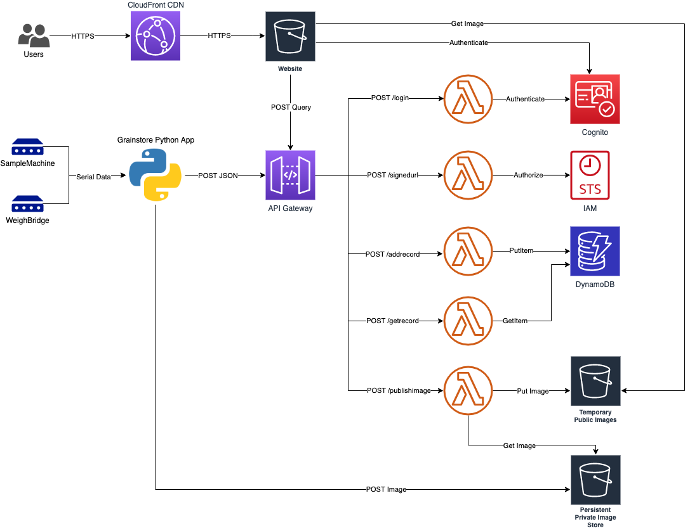

# Grainstore

AWS Serverless Infrastructure repo for Grainstore Application Components:

* API Gateway
    * /login
    * /signedurl
    * /addrecord
* Lambda
    * Login Function
    * Generate S3 Pre-Signed URL Function
    * Add Record Function
* Cognito
    * User pool
    * App Client
* S3
    * Terraform remote state bucket
    * Grainstore image data bucket
* DynamoDB
    * Terraform remote state lock table
    * Grainstore data store

Also includes a basic React Single Page Application for querying data held in DynamoDBN and S3.

## Prerequisites

* `make`
* `terraform` (>= v0.13.3)
* `npm`

## Architecture

<details><summary>Click to expand</summary>
<p>



</p>
</details>


## Build

All Infra is built using Terraform, e.g.: `make all-dev` will build and deploy a full development environment

## Sequence Diagram

<details><summary>Click to expand</summary>
<p>


</p>
</details>

## Configure the React App

The React app requires AWS configuration to be stored in `app/grainstore-ui/src/config.js` which is not stored in this repo as it contains semi-sensitive data. Example `config.js` file is as follows:

```
export default {
    cognito: {
      REGION: "<AWS_REGION>",
      USER_POOL_ID: "<COGNITO_POOL_ID>",
      APP_CLIENT_ID: "<COGNITO_APP_CLIENT_ID>"
    },
    apiGateway: {
      REGION: "<AWS_REGION>",
      URL: "<API_GATEWAY_STAGE_ENDPOINT_URL>"
    },
  };
```

## Run React App Locally

To serve the React SPA on your local machine, run the following:

`make start-app`

The site should be loaded in your browser, but if not, browse to:

`http://localhost:3000`

**Note** you will need to authenticate against Cognito to use the app.

##  Deploy the React App to S3

Authenticate to the target  AWS account, then run the `publish-to-s3.sh` script in the root of this repo.

**Note** The intention is to automate deployments triggered by git hooks.

## Example Usage

The following python (v3.8) example highlights how a new record could be added with cognito JWT based auth:

<details><summary>Show Example Code</summary>
<p>

```

#!/usr/bin/env python3
import requests
import json
from jose import jwt
from datetime import datetime, timedelta

def login(endpoint, username, password, poolid, clientid, secret):
    body = {
        "username": username,
        "password": password,
        "poolid": poolid,
        "clientid": clientid,
        "clientsecret": secret
    }
    x = requests.post(endpoint + '/login', json = body)
    print('Login StatusCode: ' + str(x.status_code))

    if x.status_code == 200:
        body = json.loads(x.text)
        id_token = body['id_token']
        refresh_token =  body['refresh_token']
        access_token = body['access_token']
    else:
        print('Login failed. StatusCode: ' + str(x.status_code))
        print('Login Response Body: ' + x.text)
        return None
    return access_token

def tokenvalid(token, region, poolid, clientid):
    # Decode token to make decision on expiry time
    # Optionally do additional validation steps here, e.g. validate cognito issuer
    # build the URL where the public keys are
    jwks_url = 'https://cognito-idp.{}.amazonaws.com/{}/' \
                '.well-known/jwks.json'.format(
                        region,
                        poolid)
    # get the keys from cognito endpoint
    jwks = requests.get(jwks_url).json()
    # decode the access token
    access_decode = jwt.decode(token, jwks, audience=clientid)
    # get the Expiry time
    expirytime = datetime.fromtimestamp(access_decode['exp'])
    if datetime.now() < expirytime:
        # Token still valid , but if less than 5 mins to go, relogin
        if expirytime - timedelta(minutes=5) < datetime.now():
            print('Token expires in less than 5m - re-auth now')
            return False
    else:
        print('token has expired  - login again')
        return False
    return True

def addrecord(endpoint, token, newrecord):
    # Now call authenticated endpoint
    headers = {
        'Authorization': token,
        'Content-Type': 'application/json'
    }
    response = requests.post(endpoint + '/addrecord', headers=headers, json = newrecord)
    print('AddRecord StatusCode: ' + str(response.status_code))
    print('AddRecord Response Body :' + response.text)
    if response.status_code != 200:
        print('ERROR received from api. StatusCode: ' + str(response.status_code))
        return False
    return True

def getsignedurl(endpoint, token, customerdetails):
    # Now call authenticated endpoint
    headers = {
        'Authorization': token,
        'Content-Type': 'application/json'
    }
    signedurl = requests.post(endpoint + '/signedurl', headers=headers, json = customerdetails)
    if signedurl.status_code != 200:
        print('ERROR getting signed url. StatusCode: ' + str(signedurl.status_code))
        return None
    return signedurl.text

def postimage(url, fields, file, uuid):
    # Open the image file in  readonly binary mode
    with open(file, 'rb') as f:
        files = {'file': (uuid, f)}
        fields['acl'] = 'private',
        http_response = requests.post(url, data=fields, files=files)
    if http_response.status_code != 204:
        # If successful, returns HTTP status code 204
        print('ERROR: File upload HTTP status code: ' + str(http_response.status_code))
        print('ERROR: Response data: ' + http_response.text)
        return False
    print('Upload via presigned url success. StatusCode: ' + str(http_response.status_code))
    return True

def main():
    region="<aws_region>"
    username = "<cognito_username>"
    password = "<cognito_password>"
    poolid = "<cognito_poolid>"
    clientid = "<cognito_appclient_id>"
    secret = "<cognito_appclient_secret>"
    apiendpoint = "https://<api_id>.execute-api.<aws_region>.amazonaws.com/<api_stage>"
    customerid = "<customer_id"

    # Login via cognito and retrieve access token
    token = login(apiendpoint, username, password, poolid, clientid, secret)
    if token == None:
        print('ERROR - Cannot proceed without valid access token')
        return

    # Do some stuff
    # 
    
    # Before making an authenticated api call, check token still valid 
    isvalid = tokenvalid(token, region, poolid, clientid)
    if not isvalid:
        token = login(apiendpoint, username, password, poolid, clientid, secret)
        if token == None:
            print('ERROR - Cannot proceed without valid access token')
            return

    # Get presigned url for image uploads and a uuid to tie image and data together
    customerdata = {
        "customerid": customerid
    }
    signedurl_response = getsignedurl(apiendpoint, token, customerdata)
    if signedurl_response == None:
        print('ERROR - Failed to fetch signed URL')
        return
    signedurl = json.loads(signedurl_response)
    url = signedurl['url']
    fields = signedurl['fields']
    uuid = signedurl['uuid']

    # POST a test image file to S3 using presigned url
    testfile = 'test_image.png'
    upload_result = postimage(url, fields, testfile, uuid)
    if not upload_result:
        print("Error uploading image. Aborting'")
        return

    # Call authenticated addnewrecord api 
     # Call authenticated addnewrecord api 
    newrecord = {
        "UUID": uuid,
        "CustomerId": customerid,
        "Weight": 23.11,
        "Value": 12.22,
        "ImageBucket": url,
        "ImageKey": fields['key']
    }
    result = addrecord(apiendpoint, token, newrecord)
    if not result:
        print('ERROR - Failed to add new record')
        return
    print('New Record Added with UUID: ' + uuid)
    return

if __name__ == "__main__":
    main()

```

</p>
</details>
